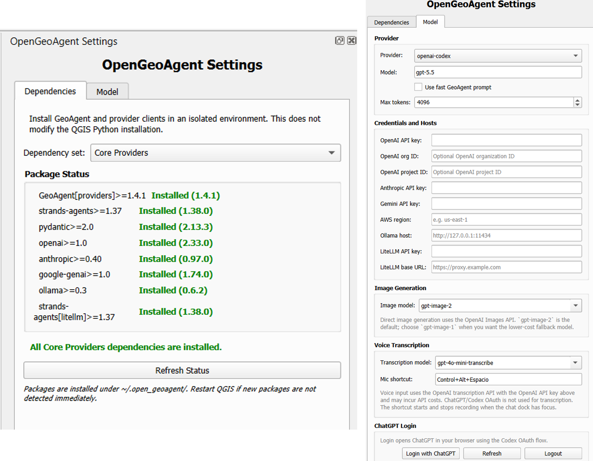
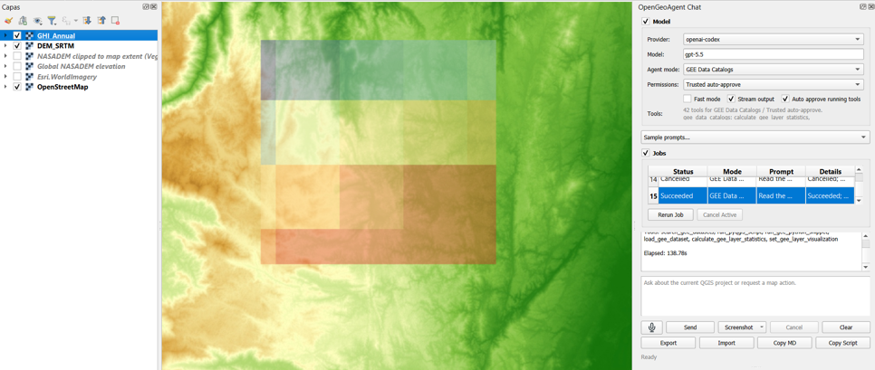



# Introducción

Este taller demuestra la integración de la Inteligencia Artificial dentro de los Sistemas de Información Geográfica (SIG) para la planificación de infraestructuras de energías renovables. La selección de sitios para plantas solares se ha abordado tradicionalmente combinando SIG con métodos multicriterio [@malczewski2006gis; @choi2019gis]. Sin embargo, utilizar la automatización nos permite realizar modelamientos dinámicos. 

Para este propósito utilizaremos el plugin **OpenGeoAgent** en QGIS para automatizar un modelo espacial de aptitud, cruzando la topografía local con datos de radiación GHI de alta resolución [@munoz2021era5].

GeoAgent es una capa compartida de agentes de IA para paquetes geoespaciales de Python, widgets de mapas en vivo y plugins de QGIS [@wu2026geoagent]. Con una interfaz consistente, proyectos como leafmap, geemap, STAC y NASA Earthdata pueden exponer sus herramientas a modelos de lenguaje grande. Desarrollado sobre Strands Agents, GeoAgent añade contexto geoespacial, metadatos estructurados, configuración de proveedores y ganchos de confirmación que pausan el agente antes de operaciones destructivas o costosas.

# Objetivos

1. **Configurar** el plugin OpenGeoAgent dentro del entorno QGIS.
2. **Ejecutar** tareas de adquisición de datos y geoprocesamiento utilizando distintos Modos de Agente (GEE Data Catalogs, General QGIS, WhiteboxTools y STAC).
3. **Integrar** restricciones topográficas (pendiente, sombreado) evaluando la estabilidad geométrica de la superficie [@polo2020solar] con datos climáticos (GHI).
4. **Documentar** el flujo de trabajo utilizando las funciones de exportación del plugin.

---

# Configuración del Plugin

Antes de iniciar el análisis geomático, el plugin OpenGeoAgent debe estar instalado y configurado, como se muestra a continuación.

1. Se instala el plugin desde el Administrador de Complementos de QGIS.
2. Se navega a `Settings > Dependencies` para instalar los clientes requeridos (ej. Core Providers, WhiteboxTools, GEE Data Catalogs).
3. Se abre el panel de Chat de OpenGeoAgent.
4. Se configura el **Provider** (ej. openai-codex) y se selecciona el **Model**.
5. Posteriormente hay que familiarizarse con el menú desplegable **Agent mode**.

::: {.callout-tip title="Documentación del Plugin"}
Para obtener instrucciones detalladas, visite la documentación oficial de GeoAgent [@wu2026geoagent]: [https://geoagent.gishub.org/qgis-plugin/](https://geoagent.gishub.org/qgis-plugin/)
:::

---

# Tareas por Modo de Plugin y Resultados

Alternaremos entre los diferentes Modos de Agente disponibles en OpenGeoAgent para completar cada fase metodológica.

## Tarea 1: Adquisición de Datos (Modo: GEE Data Catalogs)

**Objetivo:** Obtener el Modelo Digital de Elevación (SRTM 30m) y la Radiación Global Horizontal anual (ERA5-Land) superando los mapas estáticos tradicionales [@upme2015atlas].

* **Modo de Agente:** `GEE Data Catalogs`
* **Prompt Usado:**
  > "Read the current QGIS canvas extent for the Vegachí and Remedios area. Search the Google Earth Engine catalog for the USGS/SRTMGL1_003 dataset. Load the elevation band as a new raster layer named 'DEM_SRTM', applying a standard terrain color ramp based on the local min and max values. Next, query the ECMWF/ERA5_LAND/MONTHLY_AGGR collection for the year 2023, calculate the annual mean for the 'surface_solar_radiation_downwards_sum' band, and add it to the project as 'GHI_Annual'. Apply a singleband pseudocolor renderer to 'GHI_Annual' using the local canvas extent to stretch the min and max statistics."

## Tarea 2: Derivación Geomorfométrica (Modo: General QGIS)

**Objetivo:** Calcular la pendiente y orientación, y crear una máscara booleana para áreas con pendientes menores a 15 grados.

* **Modo de Agente:** `General QGIS`
* **Prompt Usado:**
  > "Using the active 'DEM_SRTM' layer, write and execute a PyQGIS script to calculate the Slope (in degrees). Then, use the Raster Calculator to create a boolean mask where the Slope is less than 15 degrees. Name this output 'Suitable_Slope_Mask' and add it to the canvas."

## Tarea 3: Simulación de Sombreado Solar (Modo: WhiteboxTools)
Objetivo: Simular el efecto del sombreado topográfico sobre un arreglo solar fijo, asumiendo una geometría estándar [@pvgismanual].

Modo de Agente: WhiteboxTools

Prompt Usado:

> "Using the WhiteboxTools provider, calculate a Hillshade for the 'DEM_SRTM' layer. Set the solar azimuth to 180 degrees (South) and the altitude to 45 degrees. Name the output 'Topographic_Shading'. Finally, generate a PyQGIS script to intersect this shading layer with the 'Suitable_Slope_Mask'."

## Tarea 4: Contexto Ambiental (Modo: STAC)

Objetivo: Cargar imágenes satelitales recientes para inspeccionar visualmente la cobertura del suelo.

Modo de Agente: STAC

Prompt Usado:

> "Read the current map extent as a WGS84 bounding box. Search the Planetary Computer catalog for Sentinel-2 L2A imagery from the last 3 months with less than 10% cloud cover. Add the preferred visual asset (true color or false color) directly to the QGIS project."

# Resultados Finales y Conclusiones
Eficiencia Metodológica: La integración de la capa GeoAgent [@wu2026geoagent] en el entorno de QGIS reduce significativamente el tiempo empleado en la extracción de series temporales complejas y el geoprocesamiento de modelos de elevación.

Evaluación Multicriterio Dinámica: A diferencia de las evaluaciones estáticas, el uso de modos específicos (General QGIS y WhiteboxTools) facilitó la creación rápida de máscaras booleanas y simulaciones de sombreado, demostrando ser una aproximación robusta para delimitar áreas físicamente viables.

Trazabilidad: Las características integradas de OpenGeoAgent, como la capacidad de exportar directamente el código de PyQGIS utilizado, garantizan que el modelo espacial de aptitud sea totalmente auditable.

# Referencias
::: {#refs}
:::